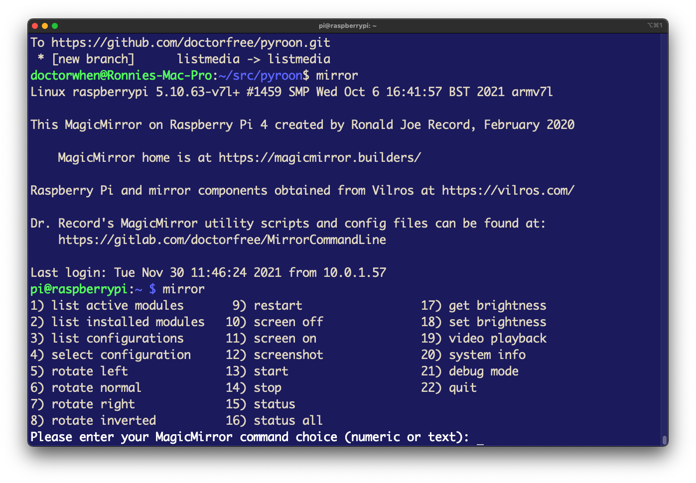
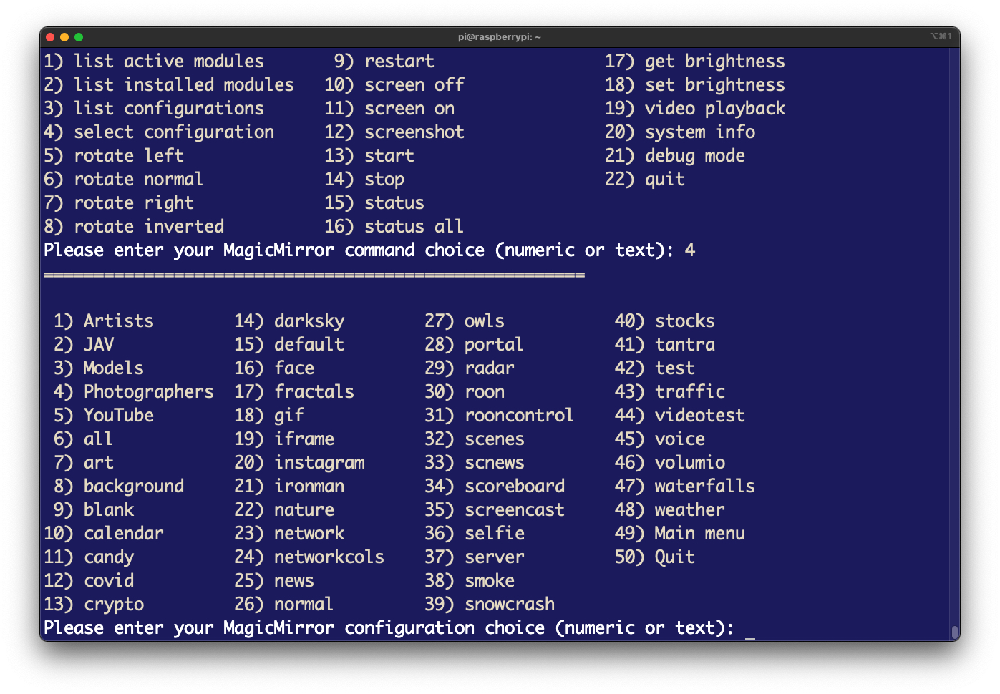

> **"The cosmic operating system uses a command line interface. It runs on
> something like a teletype, with lots of noise and heat; punched-out bits
> flutter down into its hopper like drifting stars. The demiurge sits at his
> teletype, pounding out one command line after another, specifying the values
> of fundamental constants of physics:**
>
> `universe -G 6.672e-11 -e 1.602e-19 -h 6.626e-34 -protonmass 1.673e-27`
>
> **and when he’s finished typing out the command line, his right pinky hesitates
> above the enter key for an aeon or two, wondering what’s going to happen;
> then down it comes—and the whack you hear is another Big Bang."**
>
> ― Neal Stephenson, In the Beginning...Was the Command Line

# MirrorCommandLine
MagicMirror is an open source modular smart mirror platform
(see https://magicmirror.builders/). This repository maintains an extensive
set of scripts to initialize, configure, monitor, and manage a MagicMirror.

## Table of contents

1. [Overview](#overview)
1. [Screenshots](#screenshots)
1. [Installation](#installation)
    1. [Post installation configuration](#post-installation-configuration)
    1. [Add keys to mirrorkeys](#add-keys-to-mirrorkeys)
    1. [Configure mirror script](#configure-mirror-script)
	1. [Removal](#removal)
1. [Supporting utilities and config files](#supporting-utilities-and-config-files)
1. [Remote access](#remote-access)
    1. [Remote execution of mirror commands](#remote-execution-of-mirror-commands)
    1. [Remote view of MagicMirror display](#remote-view-of-magicmirror-display)
    1. [MMM-Remote-Control integration](#mmm-remote-control-integration)
    1. [MMM-TelegramBot integration](#mmm-telegrambot-integration)
        1. [MMM-TelegramBot installation](#mmm-telegrambot-installation)
        1. [MMM-TelegramBot module config](#mmm-telegrambot-module-config)
        1. [MMM-TelegramCommands module](#mmm-telegramcommands-module)
        1. [Telegram usage](#telegram-usage)
1. [MMM-GoogleAssistant integration](#mmm-googleassistant-integration)
    1. [Google Cloud Platform API Keys](google-cloud-platform-api-keys)
1. [MMM-Scenes integration](#mmm-scenes-integration)
1. [Usage](#usage)
1. [Documentation](#documentation)
1. [Motivation](#motivation)
    1. [Introduction to Using the Command Line](#introduction-to-using-the-command-line)
    1. [Why would I need or want command line control of MagicMirror](#why-would-i-need-or-want-command-line-control-of-magicmirror)
    1. [History](#history)
1. [Contents](#contents)
1. [License](#license)

## Overview

The Mirror Command Line project provides scripts to enable
command line control of the MagicMirror system over a local network.

A frontend Bash script, `mirror`, can be installed on your MagicMirror to issue
MagicMirror commands. Currently the command line MagicMirror control scripts
include support for:
- Specifying the MagicMirror configuration file to activate
- Starting, stopping, and restarting the MagicMirror
- Display of various system info
    - Temperature
	- Memory
	- Disk
	- Usb
	- Network
	- Wireless
	- Screen
- List active/installed MagicMirror modules
- List available MagicMirror configuration files
- Rotate the MagicMirror screen
- Get or set the brightness level
- Control MagicMirror video playback
    - Start/Stop video play
	- Replay video
	- Play next video
	- Hide video playback module
	- Show video playback module
- Control the MagicMirror audio output volume level
- Get MagicMirror status
- Auto generation of new MagicMirror configuration files
- Interactive mode via menu dialogs
    - Invoked with no arguments the mirror command displays a command menu.

## Screenshots

<p float="left">
Interactive menus when invoked with no arguments<br/>
  
  
</p>

## Installation

MirrorCommandLine version 2.2 and later includes Debian format packages
which can be used to install the MirrorCommandLine utilities and images
with the Apt package management system.

To install:

[Download the latest Debian package format release](https://gitlab.com/doctorfree/MirrorCommandLine/-/releases)

Install the base MirrorCommandLine package by executing the command

```bash
sudo apt install MirrorCommandLine_<version>.deb
```
Optionally install the image archives used in many of the MirrorCommandLine config files:

```bash
sudo apt install MirrorImagesPortrait_<version>.deb
```

You can create your own custom Debian format package from the repository source.
To do so, clone the MirrorCommandLine repository:

<code>git clone ssh://gitlab.com/doctorfree/MirrorCommandLine.git</code>

or

<code>git clone `https://gitlab.com/doctorfree/MirrorCommandLine.git`</code>

Use the `mkpkg` script to create Debian format packages on a system with
the prerequisite packaging development environment. Once packages have been
created in the source repository they can be installed by executing the
`./Install` command. Packages can be removed with `./Uninstall`.

### Post installation configuration

The MirrorCommandLine installation process cannot automatically configure
your private keys which are used to access various services the MagicMirror
utilizes. For example, you may have private keys to access a weather service,
Telegram, Google services, or the MMM-Remote-Control module.

Before you can use the MirrorCommandLine utilites and config files you will
need to add any keys you wish to use to the appropriate config files and utilities.

#### Add keys to mirrorkeys

**Don't Panic!** The MirrorCommandLine package includes utilities to add and
remove private keys. To do so:

Edit the file `/usr/local/MirrorCommandLine/etc/mirrorkeys` adding the keys you have
previously generated/retrieved to each of the 'keys[FOO]' settings with corresponding
'dumb[FOO]' setting, leaving the 'dumb[FOO]' setting as-is

Add the keys you wish to set and leave those you do not wish to set empty

After adding your keys, execute the command

```bash
  '/usr/local/MirrorCommandLine/bin/showkeys'
```

The `showkeys` command will read the `mirrorkeys` file and edit the appropriate
configuration files in `/usr/local/MirrorCommandLine` containing the placeholder dummy
settings.

#### Configure mirror script

Edit the main MagicMirror management script,
[**/usr/local/MirrorCommandLine/bin/mirror**](mirror.sh), setting:

- Location of your MagicMirror installation
- IP address of your MagicMirror
- Port for your MMM-Remote-Control module
- MMM-Remote-Control API Key (this is configured by `showkeys` above)
- Configuration subdirectories

Defaults for these are:

- MM="${HOME}/MagicMirror"
- IP="MM.M.M.MM"
- PORT="8080"
- apikey="xxx_Remote-Control-API-Key_xxxxx"
- CONF_SUBDIRS="Artists JAV Models Photographers"

In most cases you will only need to set the IP address and MMM-Remote-Control API key.
The IP setting should have been configured properly during installation and the
MMM-Remote-Control API key is set by the `showkeys` command after the `mirrorkeys`
file has been configured with the API key.

A typical installation will not need to modify anything by hand in the `mirror` script.

If you have not configured an API key for MagicMirror remote control then
set the apikey to blank ( <code>apikey=</code> ).

#### Removal

To remove/uninstall the MirrorCommandLine packages execute the commands:

```bash
sudo apt remove mirror-images-portrait
sudo apt remove mirrorcommandline
```

**Note:** Removal will issue a warning about removing `/usr/local` and other
folders within `/usr/local`. This is an artifact of the Debian packaging system.
If you wish to silence that warning and prevent the Debian packaging system from
trying to remove `/usr/local` then install the
[core-custom-local Debian package](https://gitlab.com/doctorfree/core-custom-local/-/releases).

## Supporting utilities and config files

There are several supporting scripts that can be used to enhance command
line capabilites. These are installed in `/usr/local/MirrorCommandLine/bin` with
symbolic links created in `/usr/local/bin`. Ensure that `/usr/local/bin`
is in your execution PATH.

Many sample MagicMirror configuration files are provided in the
[**/usr/local/MirrorCommandLine/config**](config) directory. The installation
package script attempts to link these into your MagicMirror config folder.
The sample config files use the naming convention `config-<name>.js`.

Several custom CSS files are provided in the `/usr/local/MirrorCommandLine/css directory.
Copy and modify as needed.

Some of the more useful supporting scripts include:

- [**camsnap**](scripts/camsnap.sh)
  Snap a photo with your MagicMirror webcam
- [**chkconfig**](scripts/chkconfig.sh)
  Check your MagicMirror configuration files
- [**chkinst**](chkinst)
  Check your Mirror Command Line installation
- [**chktemp**](scripts/chktemp.sh)
  Check your MagicMirror Raspberry Pi temperature
- [**get_temps**](scripts/get_temps.sh)
  Get your MagicMirror Raspberry Pi temperature
- [**gethue**](scripts/gethue.sh)
  Get your Hue Hub properties
- [**getquote**](scripts/getquote.sh)
  Get a stock symbol quote
- [**mmapiactions**](scripts/mmapiactions.sh)
  Get the MMM-Remote-Control API actions
- [**mmgetb**](scripts/mmgetb.sh)
  Get the MagicMirror screen brightness level
- [**mmsetb**](scripts/mmsetb.sh)
  Set the MagicMirror screen brightness level
- [**rand_back**](scripts/rand_back.sh)
  Select a random desktop wallpaper
- [**reboot**](scripts/reboot.sh)
  Perform additional actions before reboot, executed as a normal user using sudo
- [**shutdown**](scripts/shutdown.sh)
  Perform additional actions before shutdown, executed as a normal user using sudo
- [**vncview**](scripts/vncview.sh)
  Remote script to start a VNC server on your MagicMirror and a VNC viewer on your desktop
- [**vol**](scripts/vol.sh)
  Script to control volume level of MagicMirror audio output
- [**wireless_conf**](scripts/wireless_conf.sh)
  Configure wireless using WPA Supplicant
- [**wireless_dot_sample**](wireless_dot_sample)
  Sample $HOME/.wireless to assist in wireless configuration

## Remote access

In order to remotely access the MagicMirror command line it is necessary to
setup SSH and associated SSH keys. That configuration is outside the scope
of this document. There are a number of guides on configuring SSH access on
a variety of systems. To get started with SSH configuration on a Raspberry Pi,
see https://www.raspberrypi.org/documentation/computers/remote-access.html

Once SSH access is configured, the [**mm**](remote/mm) script can be installed on
remote systems and used to remotely execute the mirror script on the system
hosting MagicMirror. All arguments provided to <code>mm</code> are simply
passed along to the <code>mirror</code> script.

Alternately, the <code>mirror</code> script can be executed directly by a
user logging in to the MagicMirror system in a Shell environment (e.g. a
terminal window). This can be accomplished remotely in a terminal window
on the remote system by executing the ssh command. For example, using iTerm2
on a Mac OS X system, execute the command:

<code>ssh -l pi IP_ADDRESS</code>

where IP_ADDRESS is the IP address of the MagicMirror system. Once logged into
the MagicMirror system, the <code>mirror</code> command can be executed at a
shell command prompt:
<pre>
pi@raspberrypi:~ $ mirror
</pre>

Additional remote capabilities are provided through integration with the
[MMM-Remote-Control](https://github.com/Jopyth/MMM-Remote-Control) and
[MMM-TelegramBot](https://github.com/bugsounet/MMM-TelegramBot) modules.
Accessing and controlling your MagicMirror using these facilities is
described in the following sections.

#### Remote execution of mirror commands

If you wish to execute mirror commands remotely then install the convenience
script [**mm**](remote/mm) on a system with SSH access to your MagicMirror. This
script can be used to remotely execute the main mirror script.

#### Remote view of MagicMirror display

If you wish to view the MagicMirror display remotely then install the convenience
script [**vncview**](remote/vncview) on a system with SSH access to your MagicMirror. This
script can be used to remotely execute a VNC server and locally execute a VNC client.

### MMM-Remote-Control integration

The `mirror` command line utilities can be integrated into a custom
[MMM-Remote-Control](https://github.com/Jopyth/MMM-Remote-Control) menu.
In this way the MMM-Remote-Control module can be extended to perform
many additional actions including taking a screenshot, rotating the
display, and controlling playback of video. This can, for example,
allow you to use your phone to control the MagicMirror while standing
in front of the mirror, away from your computer. Particularly handy
for taking screenshots.

The MMM-Remote-Control module provides some documentation on creating
a custom menu but it is currently incomplete. To add custom commands
to MMM-Remote-Control using the `mirror` command, see the
[MMM-Remote-Control Wiki Page](https://gitlab.com/doctorfree/MirrorCommandLine/-/wikis/Remote-Control-Custom-Menu).

#### MMM-TelegramBot integration
You can control your MagicMirrir with the `mirror` command executed remotely
using the Telegram app. This can allow you to control your MagicMirror from
anywhere by simply sending a message on your phone using the Telegram app.
To enable this feature, install the
[MMM-TelegramBot](https://github.com/bugsounet/MMM-TelegramBot)
module, setup a Telegram Bot to send and receive MMM-TelegramBot messages,
and add MMM-TelegramBot `customCommands` configuration to the MMM-TelegramBot
config section in `config/config.js`.

##### MMM-TelegramBot installation
Follow the instructions at the
[4th Party Modules Wiki](http://wiki.bugsounet.fr/en/MMM-TelegramBot)
to create a Telegram Bot, install MMM-TelegramBot, and configure your
MagicMirror `config.js` to enable Telegram commands.

##### MMM-TelegramBot module config

In addition to following the
[4th Party Modules Wiki Installation instructions](http://wiki.bugsounet.fr/en/MMM-TelegramBot/Installation)
to install the module and setup a Telegram Bot, the config section of the
MMM-TelegramBot module entry in `config.js` must be modified to add
`customCommands`. Samples of how to do this are in the config files in
this repository. For example, see the `customCommands` entry in
[**config/config-default.js**](config/config-default.js).

Here is the section of the `customCommands` array definition in the config
section of the MMM-TelegramBot module entry in `config.js` that defines the
`/mirror` Telegram command:

```javascript
{
    command: 'mirror',
    description: "Executes MagicMirror `mirror` command\nTry `/mirror status`.",
    callback: (command, handler, self) => {
        if (handler.args) {
            var exec = "mirror -D " + handler.args
        } else {
            var exec = "mirror -D status"
        }
        handler.reply("TEXT", "Executing command: " + exec)
        var sessionId = Date.now() + "_" + self.commonSession.size
        if (exec) {
            self.commonSession.set(sessionId, handler)
            self.sendSocketNotification("SHELL", {
                session: sessionId,
                exec: exec
            })
        }
    },
},
```

##### MMM-TelegramCommands module

Configuring MMM-TelegramBot customCommands can be daunting. Use the template at
[MagicMirror/config/Templates/TelegramBot-customCommands.js](https://gitlab.com/doctorfree/MirrorCommandLine/-/blob/master/config/Templates/TelegramBot-customCommands.js)
as a guide.

Alternatively, several custom TelegramBot commands have been configured
and enabled in the
[MMM-TelegramCommands module](https://gitlab.com/doctorfree/MMM-TelegramCommands).
To enable the MMM-TelegramCommands module commands, install this module:

```bash
cd ~/MagicMirror/modules
git clone https://gitlab.com/doctorfree/MMM-TelegramCommands.git
cd MMM-TelegramCommands
npm install
```

After installing MMM-TelegramCommands add the following to the modules array
of any `config.js` that has MMM-TelegramBot activated:

```javascript
    {
        module: 'MMM-TelegramCommands'
    },
```

See this
[simple example of MMM-TelegramCommands configuration](https://gitlab.com/doctorfree/MMM-TelegramCommands/-/blob/master/examples/config-simple.js) as a guide.

##### Telegram usage
Once installed and configured, you can control your MagicMirror
by sending messages in the Telegram app to your previously created Telegram Bot.
If you copied the example MMM-TelegramBot customCommands configuration in
one of the config files in this repository then you will have three new
custom Telegram commands:

- /myReboot
    - Custom reboot command which executes /usr/local/bin/reboot
- /myShutdown
    - Custom shutdown command which executes /usr/local/bin/shutdown
- /mirror
    - General purpose command which executes the /usr/local/bin/mirror command with any arguments supplied in the Telegram command (e.g. `/mirror info` will retrieve your MagicMirror system information)

A few examples follow:

To switch the MagicMirror config.js to the configuration file
'config/config-sample.js', issue the Telegram command:

```
/mirror sample
```

To retrieve the MagicMirror status, issue the command:

```
/mirror status
```

To list the MagicMirror active modules, issue the command:

```
/mirror list active
```
Any `mirror` command can be executed via Telegram in this manner.
See `mirror -u` for the `mirror` usage message.

## MMM-GoogleAssistant integration
MirrorCommandLine includes configuration files to enable voice command
control of your MagicMirror utilizing the
[MMM-GoogleAssistant](http://wiki.bugsounet.fr/en/MMM-GoogleAssistant)
module. Most of the MagicMirror config files in the config subdirectory
come preconfigured with voice command support. See
[**config/config-default.js**](config/config-default.js) for a sample config
file with voice control enabled.

In addition to preconfigured config files, MirrorCommandLine provides several
[custom MMM-GoogleAssistant recipes](modules/MMM-GoogleAssistant/recipes).
These include recipes to:
- [Enable `mirror` command support via voice](modules/MMM-GoogleAssistant/recipes/MirrorCommand.js)
    - Voice commands to:
	    - Restart MagicMirror
		- Rotate the screen
		- Turn the screen on/off
		- Mute/unmute sound
		- Copy custom config files into config.js and restart the mirror
- [Voice management of MMM-Scenes scenes](modules/MMM-GoogleAssistant/recipes/with-MMM-Scenes.js)
    - Next scene
	- Previous scene
	- Scene by number (e.g. `scene 2`) 
- [Customized reboot/restart/shutdown voice commands](modules/MMM-GoogleAssistant/recipes/myReboot-Restart-Shutdown.js)
- [Radio station play via voice](modules/MMM-GoogleAssistant/recipes/ExtRadio.js)

### Google Cloud Platform API Keys
Several MagicMirror modules require a Google Cloud Platform API. The MMM-GoogleAssistant
and MMM-GoogleMapsTraffic modules are examples of these. In order to configure
the MMM-GoogleAssistant module you will need to create a Google Action project
and enable API services for that project in the Google Cloud Platform then generate
credentials for that project. This process can seem daunting to many but once you
walk through it the process becomes more transparent. A smart young woman has
provided us with a brief and simple tutorial walkthru of the process at
[https://youtu.be/xVhqP3fBnVM](https://youtu.be/xVhqP3fBnVM).
Her video is based on the
[4th Party Modules Wiki](http://wiki.bugsounet.fr/en/MMM-GoogleAssistant/GoogleAssistantSetup)
description of this process.

**NOTE:** When authorizing the YouTube access token with `npm run tokens` as the final
step in this process, I found it necessary to modify
[MMM-GoogleAssistant/install/auth_YouTube.js](modules/MMM-GoogleAssistant/install/auth_YouTube.js)
to add a console log output of the generated URL to allow access. This was necessary
in my case because I was performing the process over an SSH connection in a terminal.
This is not necessary if you are accessing the MagicMirror directly or if you have
your DISPLAY set back to the system on which you are running SSH. If you need to use
this modification, it can be found at the link above.

## [MMM-Scenes](https://github.com/MMRIZE/MMM-Scenes#readme) integration

In addition to the voice control of MMM-Scenes described above, several `mirror`
commands have been added to support management of MMM-Scenes scenes via the
command line. Supported commands include:
- `mirror scene next` : display the next scene in the scenario
- `mirror scene prev` : display the previous scene in the scenario
- `mirror scene name` : display the scene named 'name'
- `mirror scene num`  : display scene number 'num'
- `mirror scene info` : retrieve info on MMM-Scenes configuration

## Usage

The `mirror` shell script is installed on any MagicMirror system that you want
to utilize for command line control of your MagicMirror. Remote execution of
the `mirror` command line script may be accomplished by using the "mm"
convenience script on a remote system with SSH access to your MagicMirror.

Here is the current output of "mirror -u" which displays a usage message.

<pre>
Usage: mirror [command] [args]
Where [command] can be one of the following:
    info [temp|mem|disk|usb|net|wireless|screen]
    list [active|installed|configs]
    rotate [right|left|normal|inverted]
    scene [next|prev|info|name|number]
    screen [on|off|info|status]
    stop|start|restart|mute|unmute|screenshot
    playvideo|pausevideo|nextvideo|replayvideo|hidevideo|showvideo
    vol [percent]|mute|unmute|save|restore|get
    dev | getb | setb [num] | select | status [all] | youtube
    artists_dir, models_dir, photogs_dir
    ac|ar [artist], jc|jr [idol], mc|mr [model], pc|pr [photographer], wh|whrm [dir]

Specify a config file to use by executing a command of the form:
	mirror [name]
where [name] is one of:
	 all Artists art background blank calendar candy covid crypto
	 darksky default face fractals gif iframe instagram JAV minscenes
	 mintest Models nature networkcols network news normal owls Photographers
	 portal radar rooncontrol roon sample scenes scnews scoreboard screencast
	 server smoke snowcrash stocks tantra test traffic unknown videotest
	 voice volumio waterfalls weather YouTube

or any other config file you have created in MagicMirror/config of the form:
	config-[name].js

A config filename argument will be resolved into a config filename of the form:
	config-$argument.js

A subdirectory in which to locate the config file can be specified as the second
argument, e.g. 'mirror foo bar' will attempt to use the config file bar/config-foo.js

The mirror command will attempt to match the specified config file name.
For example, 'mirror foo' would match the config file named config-food.js

Arguments can also be specified as follows:
	-a [artist], -A [artist], -b [brightness], -B, -c [config], -d, -i [info],
	-V, -N, -R (toggle video play, play next video, replay video),
	-H, -h (Hide video, Show video),
	-I, -l [list], -r [rotate], -s [screen], -S, -m [model], -M [model],
	-p [photographer], -P [photographer], -w [dir], -W [dir], -u

Examples:
	mirror		# Invoked with no arguments the mirror command displays a command menu
	mirror list active		# lists active modules
	mirror list configs		# lists available configuration files
	mirror restart		# Restart MagicMirror
	mirror fractals		# Installs configuration file config-fractals.js and restarts MagicMirror
	mirror info		# Displays all MagicMirror system information
	mirror info screen		# Displays MagicMirror screen information
	mirror dev		# Restarts the mirror in developer mode
	mirror rotate left/right/normal/inverted		# rotates the screen left, right, inverted, or normal
	mirror screen on		#  Turns the Display ON
	mirror screen off		# Turns the Display OFF
	mirror screenshot		# Takes a screenshot of the MagicMirror
	mirror status [all]		# Displays MagicMirror status, checks config syntax
	mirror getb		# Displays current MagicMirror brightness level
	mirror setb 150		# Sets MagicMirror brightness level to 150
	mirror vol 50		# Sets MagicMirror volume level to 50
	mirror wh foobar		# Creates and activates a slideshow config with pics in foobar
	mirror whrm foobar		# Deactivate and remove slideshow in foobar
	mirror -u		# Display this usage message
</pre>

## Documentation

Many MirrorCommandLine commands have manual pages. Execute `man <command-name>`
to view the manual page for a command. The `mirror` frontend is the primary
user interface for the MirrorCommandLine commands and the manual page for
`mirror` can be viewed with the command `man mirror`. Most commands also have
help/usage messages that can be viewed with the **-u** argument option,
e.g. `mirror -u`.

The manual page for the primary MirrorCommandLine user interface, `mirror`,
can be viewed by executing the command:

- `man mirror`

Manual pages for these MirrorCommandLine commands can be viewed by executing
any of the following commands (click to view the man page online):

- [man mirror](https://gitlab.com/doctorfree/MirrorCommandLine/-/blob/master/markdown/mirror.1.md)
- [man mmscene](https://gitlab.com/doctorfree/MirrorCommandLine/-/blob/master/markdown/mmscene.1.md)
- [man vol](https://gitlab.com/doctorfree/MirrorCommandLine/-/blob/master/markdown/vol.1.md)
- [man websnap](https://gitlab.com/doctorfree/MirrorCommandLine/-/blob/master/markdown/websnap.1.md)

## Motivation

### Introduction to Using the Command Line
The command line has a long and storied history in computing. Read some of that
history, learn how to open a command line terminal window on various systems,
how to get started using the command line, and see some examples of why the command
line interface is so powerful by reading the MirrorCommandLine wiki article
[Introduction to Using the Command Line](https://gitlab.com/doctorfree/MirrorCommandLine/-/wikis/Introduction-to-Using-the-Command-Line).

This introduction to the command line includes an example of how to automate
display of a specified menu on a MagicMirror at designated times of day.

### Why would I need or want command line control of MagicMirror

One might reasonably ask "Why would I need or want command line control
of my MagicMirror"? Truth be told, most MagicMirror users do not need or
want command line control of MagicMirror or any other software. They are happy
with the graphical user interfaces they use and never ever see a command
line prompt. So the answer to that question is almost always "You don't".

However, some users (mostly old propeller head codgers) are comfortable
at the command line and prefer to use it over the tedious mouse clicks
required to get anything done in a graphical user interface. Different
lanes for different brains.

I would say the most significant use case for command line control of anything
is automation. For example, if I want to schedule playback of specified music
in specific zones triggered by some event, then command line control can be
used to implement this. That can be done via Cron jobs, play something in some
zone at scheduled times. Or playback of specified songs in selected zones could
be triggered by some event like when a particular face is recognized by my smart
mirror or when my smart lights are turned to a particular profile. I use command
line control of MagicMirror coupled with Apple Siri voice commands that trigger
an SSH shortcut to run the command. There are many use cases for automation using
command line utilities.

The other main use case for command line control is simple convenience.
If you spend a lot of time in a Shell environment then it is just easier
to type a command that plays what you would like to hear where you want
to hear it than it is to switch windows, bring up a GUI, click a few times
to find what you want, and click to play it, then go back to your terminal
window and Shell env. Most people do not live in a Shell environment like
I do so this use case is not that significant.

Finally, the command line interface and the associated MagicMirror API can provide
capabilities not otherwise available. Searching, listing, and filtering
can be augmented by the plethora of tools available in a typical Shell
environment. You can pipe the output of a `mirror` command to grep, sed, awk,
and other standard utilities to produce results difficult to achieve otherwise.
That is, command line control along with the API and Shell utilities/builtins
can extend the capabilities of the MagicMirror system. The MirrorCommandLine
package also enables some features not easily available in MagicMirror.
One of these, management of a large number of preconfigured MagicMirror config files,
allows the MirrorCommandLine user to easily and quickly switch between any of these
preconfigured config files. In my household I find it frequently desirable to be able
to switch MagicMirror configs easily and quickly and I can do so by configuring these
presets to my typical use cases and executing a simple `mirror` command.

### History

This project began as an attempt to control my MagicMirror with Siri voice
commands. I was able to get Siri voice control of a MagicMirror working with
simple SSH shortcuts that execute Bash scripts on my mirror's Raspberry Pi.
Apple’s SSH shortcuts are a powerful tool for command line control. They can
be used to execute commands on systems that allow SSH access and they can
be configured to activate via voice commands. SSH shortcuts enable voice
control of anything that can be done at the command line.

I created shortcuts on my iPhone which use the “Run script over SSH”
option for Apple Scripting shortcuts. The shortcuts execute the appropriate
Bash command on my MagicMirror Pi. Once I got the MagicMirror shortcuts working
I then configured Siri to recognize various phrases to run those shortcuts.
In this manner I was able to implement Siri voice control of my MagicMirror.

Over time the project became primarily focused on the command line execution
of these scripts as I found I spend more time in a terminal at the command line
than I do talking to Siri. While voice control is still supported if configured
properly, the project is primarily command line control of MagicMirror.


## Contents

See the [MirrorCommandLine Contents](https://gitlab.com/doctorfree/MirrorCommandLine/-/wikis/MirrorCommandLine-Contents) wiki page for a full contents listing.

## License

Copyright: 2014-2021 Ronald Joe Record <ronaldrecord@gmail.com>

License: MIT
